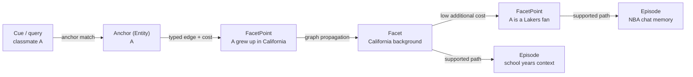

<div align="center">

# M-flow

**RAG matches chunks. GraphRAG structures context. M-flow scores evidence paths.**

Retrieval through reasoning and association — M-flow operates like a cognitive memory system.

[m-flow.ai](https://m-flow.ai) ·
[flowelement.ai](https://flowelement.ai) ·
[Quick Start](#quick-start) ·
[Architecture](docs/RETRIEVAL_ARCHITECTURE.md) ·
[Examples](examples/) ·
[OpenClaw Skill](https://clawhub.ai/flowelement-alexunbridled/mflow-memory) ·
[Contact](mailto:contact@xinliuyuansu.com)

[](#testing)
[](https://www.python.org/)
[](LICENSE)

</div>

---

## What is M-flow?

The real shift is not whether a system builds a graph, but what the graph is allowed to do at retrieval time.

### Graph topology encodes relevance.

In most RAG systems, retrieval is still dominated by similarity: the query is embedded, textual units are ranked by vector distance, and structure—if present—mainly helps organize, summarize, or expand context. Many GraphRAG systems add entities, relations, and community structure, but the graph often remains supportive rather than decisive in scoring.

M-flow takes a different approach: the graph is the scoring engine. When a query arrives, vector search casts a wide net across multiple granularities to find entry points. Then **the graph takes over** — propagating evidence along typed, semantically weighted edges, and scoring each knowledge unit by the *strongest* chain of reasoning that connects it to the query.

### Relevance is not a score. It's a path.

That distinction matters because similarity and relevance are not identical.  
*Similarity* is proximity in representation space. *Relevance* is whether the system can connect the query to the answer through a coherent structure of evidence.

<u>Similar</u> and <u>relevant</u> sometimes overlap, but they are fundamentally different.  
Consider an everyday query: **"Why was Maria upset at Monday's standup?"**

**Traditional retrieval** — keyword overlap can look related, yet miss the real cause:


**M-flow retrieval** — anchor at matching granularity, then graph propagation to the Episode bundle:

M-flow stores knowledge in a four-layer cone graph: **Episode → Facet → FacetPoint → Entity**. **A query lands on the layer that matches its granularity** — a precise cue hits a fine-grained *FacetPoint*; a broader theme hits a *Facet* or an *Episode* summary. Here the specific cue *"I wasn't told about the deadline"* anchors on a FacetPoint at the same granularity, and graph propagation then routes up through its *Facet* to the *Episode* it belongs to. Each returned **bundle is one Episode**, scored by its strongest path of evidence.


The downstream LLM then composes the final answer from the bundle's content (the Episode together with its Facets and FacetPoints). For the full path-cost mechanism, see [Retrieval Architecture](docs/RETRIEVAL_ARCHITECTURE.md).

> **Key idea:** similarity matches by overlapping words; M-flow matches by granularity-aligned anchors and then routes through the cone graph to a coherent Episode bundle.

The graph finds the answer not by matching words, but by following the chain of evidence. This difference — **from candidate matching to path-cost retrieval** — is what drives M-flow's advantage in our reported benchmarks.

**M-flow operates like a cognitive system:** it captures signal at the sharpest point of detail, traces associations through structured memory, and arrives at the right answer the way human recall does.

## How It Works

M-flow organizes knowledge into a four-level **Cone Graph** — a layered hierarchy from abstract summaries to atomic facts:

| Level | What it captures | Query example |
|-------|-----------------|---------------|
| **Episode** | A bounded semantic focus — an incident, decision process, or workflow | *"What happened with the tech stack decision?"* |
| **Facet** | One dimension of that Episode — a topical cross-section | *"What were the performance targets?"* |
| **FacetPoint** | An atomic assertion or fact derived from a Facet | *"Was the P99 target under 500ms?"* |
| **Entity** | A named thing — person, tool, metric — linked across all Episodes | *"Tell me about GPT-4o"* → surfaces all related contexts |

### Graph-routed Bundle Search

Retrieval is graph-routed: the system casts a wide net across all levels, projects the hits into the knowledge graph, propagates cost along supported evidence paths, and scores each Episode by its strongest chain of evidence.

One strong path is enough — the way a single association can trigger an entire memory.

### Association as controlled propagation

M-flow treats association as controlled graph propagation, not as a one-shot similarity match.

A query first lands on the most precise anchor it can find — an Entity, FacetPoint, Facet, or Episode. From that anchor, evidence spreads through nearby typed edges and connected memory units. Each hop expands the semantic field, but each edge also adds cost. This means association is not a random graph walk: only paths with coherent, low-cost connections remain competitive.

A simple analogy: thinking of classmate A may first bring up the fact that A grew up in California. That fact opens a wider neighborhood of California-related memories; within that neighborhood, the Lakers may become the next low-cost association. M-flow models this kind of recall as path-cost propagation through a structured memory graph.

In the inverted-cone view, each hop can be seen as moving toward a wider semantic cross-section: from a precise cue, to a related fact or facet, to the broader Episode that contains the useful context.

The figure below is a visual aid for this process, laid out left-to-right (cue on the left, broader Episodes on the right; supplementary to the text above):



### Unified multi-granularity retrieval

Storing knowledge at multiple granularities is useful, but it is not enough.

Some memory systems keep separate layers for episodic memories, atomic facts, entities, or summaries. When these layers are queried separately, retrieval tends to work best when the user's query matches the selected layer: an episodic query retrieves Episodes; an atomic query retrieves atomic facts.

M-flow connects these granularities inside one graph. Episodes, Facets, FacetPoints, Entities, and semantic edge descriptions are all searchable entry points, but they are not isolated retrieval silos. A precise query can enter through a FacetPoint and return the Episode it belongs to. A broad query can enter through an Episode summary. An entity query can bridge multiple Episodes through the same Entity node.

The user does not need to choose the right memory layer. M-flow lets the query find the right-granularity anchor, then uses the graph to return the memory bundle with the strongest supporting path.

How the routing maps in practice:

| Query style | Typical entry layer | 
|-------------|---------------------|
| Broad / thematic — *"How did Q3 planning go?"* | Episode summary (direct hit; penalized) |
| Mid-grained / topical — *"deadline communication issues"* | Facet |
| Precise / atomic — *"'I wasn't told about the deadline'"* | FacetPoint |
| Entity-centered — *"anything about Maria"* | Entity |

### M-flow retrieval at a glance

**1. Graph-led retrieval (not similarity-led)**

- Vector / hybrid search only opens entry points
- Final relevance is determined by graph propagation

> *Vectors find candidates. The graph decides relevance.*

**2. Evidence-path scoring (not flat ranking)**

- Results are ranked by the **strongest supporting path**
- Retrieval = **path-cost optimization over the graph**

> *One strong chain of evidence is enough.*

**3. Unified multi-granularity retrieval**

- Episodes, Facets, FacetPoints, Entities all act as entry points
- All granularities are connected in one graph

> *Not just multi-level storage — but multi-level retrieval.*

**4. Semantic edges as first-class signals**

- Edges carry natural-language meaning (`edge_text`)
- Relationships are searchable and scored

> *Connections carry meaning, not just structure.*

**5. Controlled propagation (not a naive graph walk)**

- Each hop expands context but also adds cost
- Only coherent, low-cost paths survive

> *Association, but with structure and discipline.*

**6. Adaptive and noise-resistant retrieval**

- Broad matches are penalized
- Node / edge importance adapts per query

> *Prevents "looks relevant" from beating "is relevant".*

> For the full technical deep-dive, see [Retrieval Architecture](docs/RETRIEVAL_ARCHITECTURE.md)

### Three more capabilities


**Coreference resolution at ingestion**

- Pronouns (`he / she / it / 那个 / 该公司`) are **resolved into concrete antecedents *before* indexing**
- The graph stores actual names and entities, not pronouns — so reference ambiguity never propagates into retrieval

*Mini-example (two-turn conversation).*

- Turn 1 : *"Maria raised the deadline issue at Monday's standup."*
- Turn 2 : *"**She** said **she** wasn't told about the change."*

*Without coreference*: each turn is ingested independently. Turn 2 contains no `Maria` token, so its FacetPoint cannot anchor on Entity `Maria`. A later query *"What did Maria say about the deadline?"* finds Turn 1 but **never reaches Turn 2** — the relevant evidence is invisible because the anchor is missing.

*With coreference*: M-flow keeps a stream-level session across turns. When Turn 2 arrives, *she* is resolved to *Maria* using the antecedent from Turn 1, producing *"**Maria** said **Maria** wasn't told about the change."* before indexing. Turn 2 now anchors on Entity `Maria` and becomes retrievable through the same Entity bridge.

> *Pronouns get resolved before they reach the graph.* See the [coreference module](coreference/README.md).

**Face-aware memory partitioning (real-time routing)**

- Optional integration with [fanjing-face-recognition](https://github.com/FlowElement-ai/fanjing-face-recognition) detects who is in front of the camera in real time
- Each recognized person is automatically mapped to **their own memory partition** (dataset)
- Conversations are ingested into and retrieved from the right partition with no manual switching — multi-person memory isolation by biometric identity

> *Each face has its own memory; the system routes by who is talking.* See [Playground with Face Recognition](#playground-with-face-recognition).

**Procedural memory — the abstract dimension**

- Beyond factual knowledge, M-flow extracts **reusable abstract patterns the LLM cannot pre-train on**: your habits, workflows, decision rules, naming conventions, format preferences — captured once, applied across future interactions

> *The reusable abstract know-how about you and your work that no foundation model can already have.*

## Benchmarks

All systems use gpt-5-mini (answer) + gpt-4o-mini (judge). Cat 5 (adversarial) excluded from LoCoMo.

### LoCoMo-10

**Aligned (top-k = 10)**

| System | LLM-Judge | Answer LLM | Judge LLM | Top-K |
|--------|:---------:|------------|-----------|:-----:|
| **M-flow** | **81.8%** | gpt-5-mini | gpt-4o-mini | 10 |
| Cognee Cloud | 79.4% | gpt-5-mini | gpt-4o-mini | 10 |
| Zep Cloud (7e+3n) | 73.4% | gpt-5-mini | gpt-4o-mini | 10 |
| Supermemory Cloud | 64.4% | gpt-5-mini | gpt-4o-mini | 10 |

**With vendor-default retrieval budgets**

| System | LLM-Judge | Answer LLM | Judge LLM | Top-K |
|--------|:---------:|------------|-----------|:-----:|
| **M-flow** | **81.8%** | gpt-5-mini | gpt-4o-mini | 10 |
| Cognee Cloud | 79.4% | gpt-5-mini | gpt-4o-mini | 10 |
| Zep Cloud (20e+20n) | 78.4% | gpt-5-mini | gpt-4o-mini | 40 |
| Mem0ᵍ Cloud (published) | 68.5% | — | — | — |
| Mem0 Cloud (published) | 67.1% | — | — | — |
| Supermemory Cloud | 64.4% | gpt-5-mini | gpt-4o-mini | 10 |
| Mem0 Cloud (tested) | 50.4% | gpt-5-mini | gpt-4o-mini | 30 |

### LongMemEval

| System | LLM-Judge | Temporal (60) | Multi-session (40) |
|--------|:---------:|:-------------:|:------------------:|
| **M-flow** | **89%** | **93%** | **82%** |
| Supermemory Cloud | 74% | 78% | 68% |
| Mem0 Cloud | 71% | 77% | 63% |
| Zep Cloud | 61% | 82% | 30% |
| Cognee | 57% | 67% | 43% |

Per-category breakdowns, reproduction scripts, raw data, and methodology for all systems: [mflow-benchmarks](https://github.com/FlowElement-ai/mflow-benchmarks)

## Features

| | |
|---------|-------------|
| **Episodic + Procedural memory** | Hierarchical recall for facts and step-by-step knowledge |
| **5 retrieval modes** | Episodic, Procedural, Triplet Completion, Lexical, Cypher |
| **50+ file formats** | PDFs, DOCX, HTML, Markdown, images, audio, and more |
| **Multi-DB support** | LanceDB, Neo4j, PostgreSQL/pgvector, ChromaDB, KùzuDB, Pinecone |
| **LLM-agnostic** | OpenAI, Anthropic, Mistral, Groq, Ollama, LLaMA-Index, LangChain |
| **Precise summarization** | Preserves all factual details (dates, numbers, names) at the cost of lower compression — RAG context will be longer but more accurate |
| **MCP server** | Expose memory as Model Context Protocol tools for any IDE |
| **CLI & Web UI** | Interactive console, knowledge graph visualization, config wizard |

> **Retrieval modes**: **Episodic** is the primary retrieval mode — it uses graph-routed Bundle Search for best accuracy and is used in all benchmarks. **Triplet Completion** is a simpler vector-based mode suited for customization and secondary development. See [Retrieval Architecture](docs/RETRIEVAL_ARCHITECTURE.md) for details.

## Quick Start

### One-Command Setup (Docker)

```bash
git clone https://github.com/FlowElement-ai/m_flow.git && cd m_flow
./quickstart.sh
```

The script checks your environment, configures API keys interactively, and starts the full stack (backend + frontend). On Windows, use `.\quickstart.ps1`.

### Install via pip

```bash
pip install mflow-ai         # or: uv pip install mflow-ai
export LLM_API_KEY="sk-..."
```

### Install from Source

```bash
git clone https://github.com/FlowElement-ai/m_flow.git && cd m_flow
pip install -e .             # editable install for development
```

### Run

```python
import asyncio
import m_flow


async def main():
    await m_flow.add("M-flow builds persistent memory for AI agents.")
    await m_flow.memorize()

    # query() defaults to episodic graph-routed Bundle Search.
    results = await m_flow.query("How does M-flow work?")
    for item in results.context:
        print(item)


asyncio.run(main())
```

### CLI

```bash
mflow add "M-flow builds persistent memory for AI agents."
mflow memorize
mflow search "How does M-flow work?" --query-type EPISODIC
mflow -ui          # Launch the local web console
```

## Architecture Overview

```
┌───────────────┐     ┌───────────────┐     ┌───────────────┐
│  Data Input   │────▶│    Extract    │────▶│   Memorize    │
│  (50+ formats)│     │  (chunking,   │     │  (KG build,   │
│               │     │   parsing)    │     │  embeddings)  │
└───────────────┘     └───────────────┘     └───────┬───────┘
                                                    │
                      ┌───────────────┐     ┌───────▼───────┐
                      │    Search     │◀────│     Load      │
                      │  (graph-routed│     │   (graph +    │
                      │  bundle search│     │  vector DB)   │
                      └───────────────┘     └───────────────┘
```

## Project Layout

```
m_flow/              Core Python library & API
├── api/             FastAPI routers (add, memorize, search, …)
├── cli/             Command-line interface (`mflow`)
├── adapters/        DB adapters (graph, vector, cache)
├── core/            Domain models (Episode, Facet, FacetPoint, …)
├── memory/          Memory processing (episodic, procedural)
├── retrieval/       Search & retrieval algorithms
├── pipeline/        Composable pipeline tasks & orchestration
├── auth/            Authentication & multi-tenancy
├── shared/          Logging, settings, cross-cutting utilities
├── tests/           Unit & integration tests
└── api/v1/playground/  Face-aware interactive chat (Playground)

m_flow-frontend/     Next.js web console
m_flow-mcp/          Model Context Protocol server
mflow_workers/       Distributed execution helpers (Modal, workers)
examples/            Runnable example scripts
docs/                Architecture & design documents
```

## Development

```bash
git clone https://github.com/FlowElement-ai/m_flow.git && cd m_flow
uv sync --dev --all-extras --reinstall

# Test
PYTHONPATH=. uv run pytest m_flow/tests/unit/ -v

# Lint
uv run ruff check . && uv run ruff format .
```

See [`CONTRIBUTING.md`](CONTRIBUTING.md) for the full contributor guide.

## Deployment

### Docker

```bash
docker compose up                       # Backend only
docker compose --profile ui up          # Backend + frontend
docker compose --profile neo4j up       # Backend + Neo4j
docker compose --profile postgres up    # Backend + PostgreSQL + PGVector
```

### Playground with Face Recognition

The Playground provides interactive multi-person conversations with face-aware memory.
It requires [fanjing-face-recognition](https://github.com/FlowElement-ai/fanjing-face-recognition) as a companion service.

**Quick setup** (clones repo, downloads models, configures `.env`):

```bash
./scripts/setup-playground.sh
```

The script detects your OS and prints the exact launch commands when done.

> **Camera access:** Face recognition requires a camera. On macOS/Windows, Docker cannot
> access USB cameras — run fanjing-face-recognition directly on the host (see "Recommended
> setup" below). The `--profile playground` Docker service is only for Linux hosts with
> `/dev/video0` access.

<details>
<summary><strong>Manual setup</strong> (if you prefer step-by-step)</summary>

```bash
# 1. Clone fanjing-face-recognition next to m_flow
git clone https://github.com/FlowElement-ai/fanjing-face-recognition.git ../fanjing-face-recognition

# 2. Download face models
cd ../fanjing-face-recognition
python scripts/download_model.py        # det_10g.onnx  (detection)
python scripts/download_arcface.py      # w600k_r50.onnx (embedding)
python scripts/download_silero_vad.py    # silero_vad_half.onnx (voice activity detection)
curl -L -o models/face_landmarker.task \
  "https://storage.googleapis.com/mediapipe-models/face_landmarker/face_landmarker/float16/1/face_landmarker.task"

# 3. Prepare .env (if not done already)
cd ../m_flow
cp .env.template .env                   # then edit .env: set LLM_API_KEY, etc.
python -c "import secrets; print('FACE_API_KEY=' + secrets.token_urlsafe(32))" >> .env
```

**Recommended setup (macOS/Windows) — fanjing on host + M-flow in Docker:**

```bash
# Terminal 1: face recognition (on host — has camera access)
cd fanjing-face-recognition
export FACE_API_KEY="<same key from .env>"
pip install -r requirements.txt
python run_web_v2.py --host 0.0.0.0 --port 5001 --no-browser

# Terminal 2: M-flow backend + frontend (in Docker)
cd m_flow
docker compose --profile ui up --build -d
```

**Linux-only — everything in Docker:**

```bash
docker compose --profile ui --profile playground up --build -d
```

**Fully local (no Docker):**

```bash
# Terminal 1: face recognition
cd fanjing-face-recognition
export FACE_API_KEY="<same key>"
python run_web_v2.py --host 0.0.0.0 --port 5001 --no-browser

# Terminal 2: M-flow backend
cd m_flow
export FACE_API_KEY="<same key>"
python -m uvicorn m_flow.api.server:app --host 0.0.0.0 --port 8000
```

The Playground UI is available at `http://localhost:3000` → Playground tab.
The face recognition service runs at `http://localhost:5001`.

> **Note:** When M-flow runs inside Docker and fanjing runs on the host,
> the backend automatically translates `localhost` → `host.docker.internal`.
> No manual URL configuration is needed.

</details>

### MCP Server

```bash
cd m_flow-mcp
uv sync --dev --all-extras
uv run python src/server.py --transport sse
```

## Testing

```bash
PYTHONPATH=. pytest m_flow/tests/unit/ -v        # ~963 test cases
PYTHONPATH=. pytest m_flow/tests/integration/ -v  # Needs .env with API keys
```

## Contributing

We welcome contributions! Please see [CONTRIBUTING.md](CONTRIBUTING.md) for guidelines, and our [Code of Conduct](CODE_OF_CONDUCT.md) for community standards.

## License

M-flow is licensed under the [Apache License 2.0](LICENSE).

```
Copyright 2026 Junting Hua

Licensed under the Apache License, Version 2.0.
You may obtain a copy of the License at http://www.apache.org/licenses/LICENSE-2.0
```
