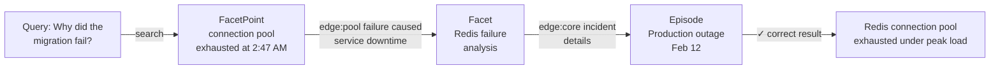

<div align="center">

# M-flow

**Graph RAG finds what's similar. M-flow finds what's relevant.**

Retrieval through reasoning and association — M-flow operates like a cognitive memory system.

[m-flow.ai](https://m-flow.ai) ·
[flowelement.ai](https://flowelement.ai) ·
[Quick Start](#quick-start) ·
[Architecture](docs/RETRIEVAL_ARCHITECTURE.md) ·
[Examples](examples/) ·
[OpenClaw Skill](https://clawhub.ai/flowelement-alexunbridled/mflow-memory) ·
[Contact](mailto:contact@xinliuyuansu.com)

[](#testing)
[](https://www.python.org/)
[](LICENSE)

</div>

---

## What is M-flow?

The fundamental shift is this: **existing systems build graphs but still retrieve by embedding distance. M-flow makes the graph the retrieval mechanism itself.**

RAG embeds chunks and ranks by vector similarity. GraphRAG goes further — it extracts entities, builds a knowledge graph, and generates community summaries. But when a query arrives, retrieval still reduces to embedding the query and matching against stored text. The graph informs what gets embedded; it does not participate in how results are scored. The retrieval step remains **similarity-driven**.

M-flow takes a different approach: the graph is not a preprocessing step — it is the scoring engine. When a query arrives, vector search casts a wide net across multiple granularities to find entry points. Then **the graph takes over** — propagating evidence along typed, semantically weighted edges, and scoring each knowledge unit by the tightest chain of reasoning that connects it to the query.

Similar and relevant sometimes overlap, but they are fundamentally different. Consider the query **"Why did the migration fail?"**

**Traditional retrieval** — matches by surface similarity:


**M-flow retrieval** — traces through the knowledge graph:



> Zero keyword overlap with "migration" — found through graph path, not text similarity.

The graph finds the answer not by matching words, but by following the chain of evidence. This difference — **from distance-based ranking to path-based reasoning** — is what drives M-flow's consistent advantage across benchmarks.

**M-flow operates like a cognitive system: it captures signal at the sharpest point of detail, traces associations through structured memory, and arrives at the right answer the way human recall does.**

## How It Works

M-flow organizes knowledge into a four-level **Cone Graph** — a layered hierarchy from abstract summaries to atomic facts:

| Level | What it captures | Query example |
|-------|-----------------|---------------|
| **Episode** | A bounded semantic focus — an incident, decision process, or workflow | *"What happened with the tech stack decision?"* |
| **Facet** | One dimension of that Episode — a topical cross-section | *"What were the performance targets?"* |
| **FacetPoint** | An atomic assertion or fact derived from a Facet | *"Was the P99 target under 500ms?"* |
| **Entity** | A named thing — person, tool, metric — linked across all Episodes | *"Tell me about GPT-4o"* → surfaces all related contexts |

Retrieval is **graph-routed**: the system casts a wide net across all levels, projects hits into the knowledge graph, propagates cost along every possible path, and scores each Episode by its **tightest chain of evidence**. One strong path is enough — the way a single association triggers an entire memory.

> For the full technical deep-dive, see [Retrieval Architecture](docs/RETRIEVAL_ARCHITECTURE.md)

## Benchmarks

All benchmarks use gpt-5-mini (answer) + gpt-4o-mini (judge) + top-k=10.

### LoCoMo-10

| System | LLM-Judge |
|--------|:---------:|
| **M-flow** | **81.8%** |
| Cognee Cloud | 79.4% |
| Zep Cloud | 73.4% |
| Supermemory Cloud | 64.4% |

### LongMemEval

| System | LLM-Judge |
|--------|:---------:|
| **M-flow** | **89%** |
| Supermemory Cloud | 74% |
| Mem0 | 71% |
| Zep Cloud | 61% |
| Cognee | 57% |

Per-category breakdowns, reproduction scripts, raw data, and methodology for all systems: [mflow-benchmarks](https://github.com/FlowElement-ai/mflow-benchmarks)

## Features

| | |
|---------|-------------|
| **Episodic + Procedural memory** | Hierarchical recall for facts and step-by-step knowledge |
| **5 retrieval modes** | Episodic, Procedural, Triplet Completion, Lexical, Cypher |
| **50+ file formats** | PDFs, DOCX, HTML, Markdown, images, audio, and more |
| **Multi-DB support** | LanceDB, Neo4j, PostgreSQL/pgvector, ChromaDB, KùzuDB, Pinecone |
| **LLM-agnostic** | OpenAI, Anthropic, Mistral, Groq, Ollama, LLaMA-Index, LangChain |
| **Precise summarization** | Preserves all factual details (dates, numbers, names) at the cost of lower compression — RAG context will be longer but more accurate |
| **MCP server** | Expose memory as Model Context Protocol tools for any IDE |
| **CLI & Web UI** | Interactive console, knowledge graph visualization, config wizard |

> **Retrieval modes**: **Episodic** is the primary retrieval mode — it uses graph-routed Bundle Search for best accuracy and is used in all benchmarks. **Triplet Completion** is a simpler vector-based mode suited for customization and secondary development. See [Retrieval Architecture](docs/RETRIEVAL_ARCHITECTURE.md) for details.

## Quick Start

### One-Command Setup (Docker)

```bash
git clone https://github.com/FlowElement-ai/m_flow.git && cd m_flow
./quickstart.sh
```

The script checks your environment, configures API keys interactively, and starts the full stack (backend + frontend). On Windows, use `.\quickstart.ps1`.

### Install via pip

```bash
pip install mflow-ai         # or: uv pip install mflow-ai
export LLM_API_KEY="sk-..."
```

### Install from Source

```bash
git clone https://github.com/FlowElement-ai/m_flow.git && cd m_flow
pip install -e .             # editable install for development
```

### Run

```python
import asyncio
import m_flow


async def main():
    await m_flow.add("M-flow builds persistent memory for AI agents.")
    await m_flow.memorize()

    results = await m_flow.search("How does M-flow work?")
    for r in results:
        print(r)


asyncio.run(main())
```

### CLI

```bash
mflow add "M-flow builds persistent memory for AI agents."
mflow memorize
mflow search "How does M-flow work?"
mflow -ui          # Launch the local web console
```

## Architecture Overview

```
┌───────────────┐     ┌───────────────┐     ┌───────────────┐
│  Data Input   │────▶│    Extract    │────▶│   Memorize    │
│  (50+ formats)│     │  (chunking,   │     │  (KG build,   │
│               │     │   parsing)    │     │  embeddings)  │
└───────────────┘     └───────────────┘     └───────┬───────┘
                                                    │
                      ┌───────────────┐     ┌───────▼───────┐
                      │    Search     │◀────│     Load      │
                      │  (graph-routed│     │   (graph +    │
                      │  bundle search│     │  vector DB)   │
                      └───────────────┘     └───────────────┘
```

## Project Layout

```
m_flow/              Core Python library & API
├── api/             FastAPI routers (add, memorize, search, …)
├── cli/             Command-line interface (`mflow`)
├── adapters/        DB adapters (graph, vector, cache)
├── core/            Domain models (Episode, Facet, FacetPoint, …)
├── memory/          Memory processing (episodic, procedural)
├── retrieval/       Search & retrieval algorithms
├── pipeline/        Composable pipeline tasks & orchestration
├── auth/            Authentication & multi-tenancy
├── shared/          Logging, settings, cross-cutting utilities
└── tests/           Unit & integration tests

m_flow-frontend/     Next.js web console
m_flow-mcp/          Model Context Protocol server
mflow_workers/       Distributed execution helpers (Modal, workers)
examples/            Runnable example scripts
docs/                Architecture & design documents
```

## Development

```bash
git clone https://github.com/FlowElement-ai/m_flow.git && cd m_flow
uv sync --dev --all-extras --reinstall

# Test
PYTHONPATH=. uv run pytest m_flow/tests/unit/ -v

# Lint
uv run ruff check . && uv run ruff format .
```

See [`CONTRIBUTING.md`](CONTRIBUTING.md) for the full contributor guide.

## Deployment

### Docker

```bash
docker compose up                       # Backend only
docker compose --profile ui up          # Backend + frontend
docker compose --profile neo4j up       # Backend + Neo4j
```

### MCP Server

```bash
cd m_flow-mcp
uv sync --dev --all-extras
uv run python src/server.py --transport sse
```

## Testing

```bash
PYTHONPATH=. pytest m_flow/tests/unit/ -v        # ~963 test cases
PYTHONPATH=. pytest m_flow/tests/integration/ -v  # Needs .env with API keys
```

## Contributing

We welcome contributions! Please see [CONTRIBUTING.md](CONTRIBUTING.md) for guidelines, and our [Code of Conduct](CODE_OF_CONDUCT.md) for community standards.

## License

M-flow is licensed under the [Apache License 2.0](LICENSE).

```
Copyright 2026 Junting Hua

Licensed under the Apache License, Version 2.0.
You may obtain a copy of the License at http://www.apache.org/licenses/LICENSE-2.0
```
